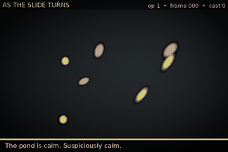
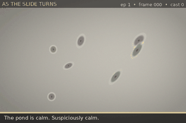
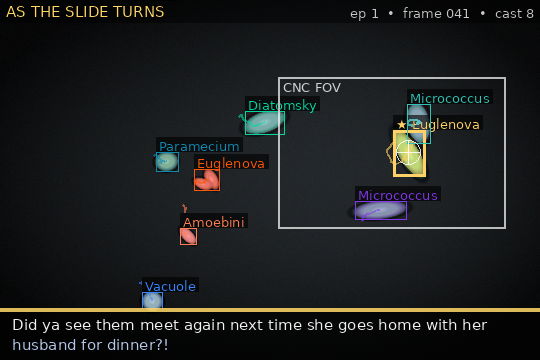
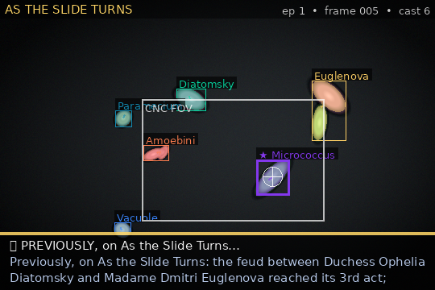
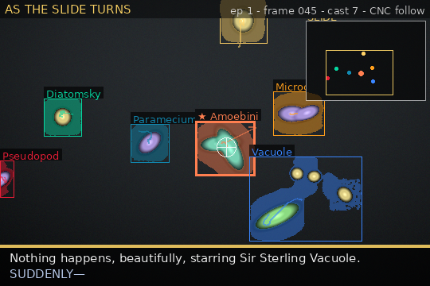

# 🔬 SoapScope — the Autonomous Cellular Soap Opera

> Point a microscope at some pond water. Let AI follow the microbes around and
> narrate their lives like a daytime soap / a Gary Larson cartoon — while a CNC
> stage keeps today's *star* centred in frame.



*A synthetic episode of **As the Slide Turns**: tracked microbes get names,
archetypes and feuds; the white box is the CNC stage's field of view following
the ★ star; the bar narrates the drama.*

SoapScope is a full, **local, CPU-only** prototype of that pipeline. It runs
today with nothing but `numpy` + `Pillow`, and every heavy part (SAM3
segmentation, a local LLM narrator, a real CNC stage) slots in later behind a
stable interface. It's built and improved by a **Karpathy-style autoresearch
loop** — see [`AUTORESEARCH_JOURNAL.md`](AUTORESEARCH_JOURNAL.md).

## Why it works without a lab (yet)

The whole software stack is prototyped from **static video** (or a built-in
synthetic microbe world with ground truth). Swap the video source for a real
clip from HuggingFace/Kaggle/GitHub, or the simulated stage for a
microcontroller — nothing else changes.

```
video → segment → track → features → drama → stage → render
```

| Stage | Today (runs anywhere) | Drops in later |
|-------|-----------------------|----------------|
| **Video** | synthetic world + ground truth; PNG-frame folders | real microscopy clips, webcam |
| **Segment** | classical numpy CC (polarity / adaptive / temporal) | **FastSAM / MobileSAM / SAM** (drop-in; see below) |
| **Track** | Kalman + Hungarian, stable IDs (MOTA-measured) | SAM3 video propagation |
| **Drama** | template / **local LLM** / **BLIP-grounded VLM** narrators | bigger VLM, two-stage |
| **Stage** | `SimulatedStage` + JSON protocol; **moving-crop pan** across a larger slide | real **CNC over serial** |
| **Render** | annotated GIF + transcript | mp4, live web viewer |

## Quickstart

```bash
pip install -e .            # core deps: numpy + Pillow only
# or: pip install -r requirements.txt

python -m soapscope.cli demo
# → out/episode.gif, out/transcript.txt, out/stage_commands.jsonl, out/metrics.json
```

Sample narration (`out/transcript.txt`):

```
[0012] (ENCOUNTER) It's the confrontation we were promised: Madame Dmitri
       Euglenova vs Contessa Genevieve Micrococcus, no notes.
[0024] (CHASE) Count Dmitri Pseudopod pursues Duchess Ophelia Diatomsky
       across the slide. Is it love? Is it lunch? Yes.
[0066] (FLEE) Madame Dmitri Euglenova FLEES from Count Vesper Micrococcus!
       The betrayal! The velocity!
```

Each frame also emits a stage command a microcontroller can consume
(`out/stage_commands.jsonl`):

```json
{"t": 4, "cmd": "move_abs", "x": 67.39, "y": 40.21}
```

## CLI

```bash
soapscope demo --frames 140 --seed 7             # synthetic dark-field episode
soapscope demo --style brightfield               # dark microbes on a light field
soapscope run --input clip.webm --max-frames 80  # a real video file (mp4/webm/ogv/…)
soapscope run --input path/to/frames/            # …or a directory of PNG frames
soapscope experiment --rounds 12                 # autoresearch: hill-climb the config
soapscope sweep --param segment.threshold --values 0.2,0.3,0.4
soapscope protocol                               # print the CNC wire protocol
```

## Real microscopy video



*Bright-field mode: dark microbes with phase halos on a light field — the
common real-microscopy look, auto-detected and segmented.*

Grab a small public-domain clip and narrate it in two commands:

```bash
pip install -e .[video]                 # imageio + a bundled ffmpeg (no system ffmpeg needed)
python scripts/fetch_sample_video.py    # → data/videos/<clip> (Wikimedia Commons, public domain)
python -m soapscope.cli run --input data/videos/Swift_ciliate.webm --max-frames 80
```

The segmenter **auto-detects contrast polarity** (bright microbes on dark
background vs dark microbes on a light one) and uses adaptive local thresholding
so vignetting and phase halos don't fool it — no per-clip tuning needed to get a
watchable first cut.

For noisy real footage, `run` also defaults to **temporal motion-foreground**
segmentation plus morphological cleanup, which erases static texture and
compression speckle — on our test clip that cut fragmentation ~6× (77 → 13
tracks, and mean track length +84%). Add `--no-temporal` for a moving/panning
stage where the background isn't static. For **clean** footage, `--hybrid` gates
the whole-body spatial mask by motion so moving microbes stay one blob instead
of splitting into motion crescents (noisy compressed clips prefer pure motion).

## SAM segmentation (SAM3 / FastSAM / MobileSAM)

The brief's marquee ask — a SOTA segmentation model — drops in behind the same
interface:

```bash
pip install -e .[sam]                        # ultralytics (FastSAM/MobileSAM/SAM)
# fetch a weight (models/ is git-ignored), then:
python -m soapscope.cli run --input clip.webm --backend sam \
    --sam-backend mobile_sam --sam-model models/mobile_sam.pt
```

`SamSegmenter` runs "segment everything" per frame and adapts the masks to the
same `Detection` contract the classical path uses, so tracking, drama and the
CNC stage are unchanged. **Reality check:** on CPU, MobileSAM is ~**0.03 fps**
(~29 s/frame) vs ~40–55 fps for the classical/temporal path — so SAM is a
quality/offline (or GPU) option, and classical stays the near-real-time default.
The pluggable design is the point: pick the backend that fits your hardware.

## Local-LLM narrator

By default the narration comes from an offline template engine (instant, funny,
with feud/romance memory). For genuinely *generative* captions, swap in a small
local LLM:

```bash
pip install -e .[llm]                         # transformers + accelerate (+ CPU torch)
python -m soapscope.cli demo --narrator llm   # default model: Qwen2.5-0.5B-Instruct
```



The LLM turns each dramatic *beat* (a chase, a collision, a mitotic "birth")
plus the characters' names and history into one Gary-Larson-style line — e.g.
*"Did ya see them meet again next time she goes home with her husband for
dinner?!"* It downloads from HuggingFace and runs on CPU at **~2.4 s/caption**
(captions fire every few frames, so a short clip is seconds of narration). Any
failure falls back to the template narrator, so the pipeline never breaks. The
template stays the default for hard-real-time; the LLM is the quality option.

### Grounded (VLM) captions

`--narrator vlm` grounds the caption in what the microbe actually *looks* like.
A small local **BLIP** captioner reads the star's thumbnail and returns an
appearance phrase, which is styled into a soap-opera line:

> Count Dmitri Pseudopod — glowing green — gives chase across the slide.

BLIP is fast (~0.6 s/describe on CPU) and grounded, unlike a tiny instruct-VLM
which is ~60× slower and hallucinates on abstract blobs (measured — see the
journal). `pip install -e .[vlm]`, then `demo --narrator vlm`.

## A serialized show (season memory)



Run episodes with a shared season file and the show remembers itself:

```bash
python -m soapscope.cli demo --season out/season.json   # run this repeatedly
```

Each new episode opens with a **"Previously, on As the Slide Turns…"** recap of
the biggest prior moments and closes with a **cliffhanger**. Feuds and romances
**accumulate across episodes** (a chemistry rating that climbs 3 → 7 → …, a feud
that deepens from its "3rd act" to "9 acts deep"), and — because the cast is
seeded — the same characters recur. It's a genuinely serialized soap opera:
`season.json` holds the whole show's lore.

## The CNC stage as an API

The pipeline only ever talks to the abstract `CNCStage` interface. A real
microcontroller (Arduino / RP2040 / ESP32) speaks newline-delimited JSON over
USB serial — see [`hardware/`](hardware/) for the protocol and a firmware stub.
`SimulatedStage` implements the same interface so the entire control loop is
testable from static video.

### Moving-crop stage — following microbes across the slide



When the slide is larger than the camera, the stage **pans to follow the star**
and microbes drift in and out of view — the brief's core premise, made literal:

```bash
python -m soapscope.cli demo --moving --world-scale 1.8
```

The minimap (top-right) shows the whole slide with every microbe as a dot and a
yellow rectangle marking where the camera is looking. Tracking runs in **world
coordinates** (stage-motion-compensated), so the stage panning isn't mistaken
for microbe motion. Each frame emits a `move_abs` command — the same stream real
CNC hardware would execute. Following cut the star's off-centre distance ~41% vs
a frozen stage, panning ~1000 px across the slide to do it.

## Autoresearch

Following [karpathy/autoresearch](https://github.com/karpathy/autoresearch):
propose a tweak, run the fixed benchmark, measure a single `score`, keep it only
if it improved, repeat. Here the "training script" is the whole
`PipelineConfig`, and the metric blends tracking accuracy, narration variety and
speed. A cron loop drives it every 15 minutes; results land in the journal.

## Status

End-to-end and running on **real internet-sourced microscopy video**. Segment
with pure-numpy classical/temporal (~40–55 fps CPU) or **SAM / MobileSAM**;
narrate with the offline template engine or a **local LLM** (Qwen2.5-0.5B).
Synthetic benchmark ≈ 0.94 (94% recall); real clips are watchable out of the
box. Everything heavy (SAM, LLM) is an optional drop-in behind a stable
interface, so classical + template stay the near-real-time defaults. Roadmap and
experiment log: [`AUTORESEARCH_JOURNAL.md`](AUTORESEARCH_JOURNAL.md).

## License

MIT — see [LICENSE](LICENSE).
